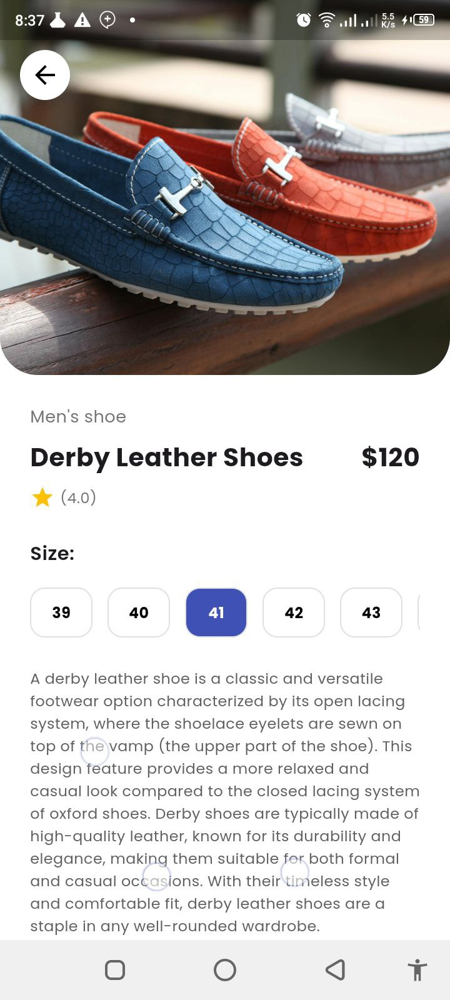
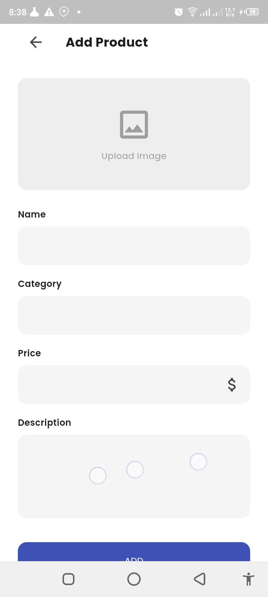
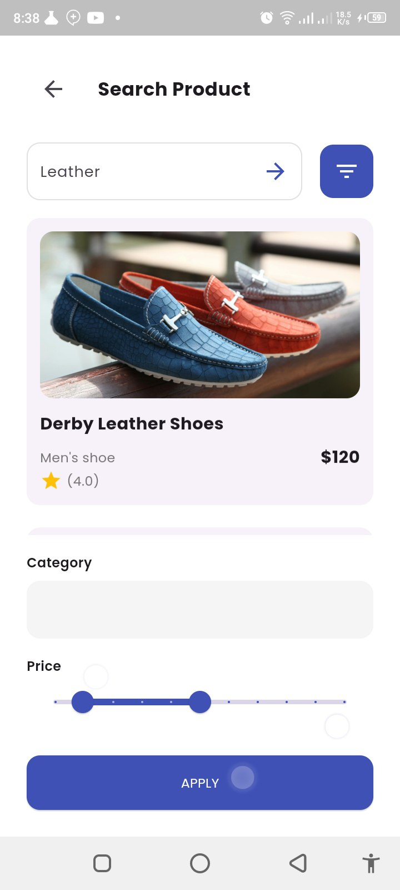
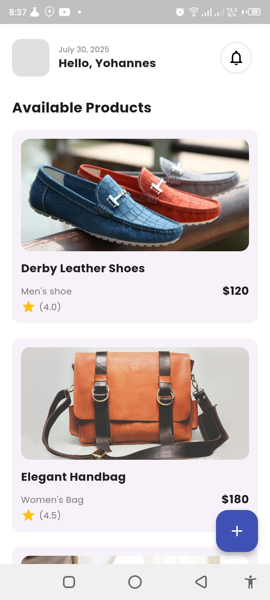

# Simple E-Commerce Flutter App

A simple but fully functional e-commerce application UI built with Flutter. This project demonstrates navigation, state management, and building a clean, modern user interface based on provided designs.

## Key Features

- **View Products:** Browse a list of available products on the home screen.
- **Product Details:** Tap on any product to see a detailed view with a description and size options.
- **Add & Update:** Add new products or update existing ones through a dedicated form.
- **Delete Products:** Remove products from the list.
- **Search & Filter:** A UI for searching products and filtering by category or price.

## Screenshots

Here are the main screens of the application:

| Home Screen | Product Detail |
| :---: | :---: |
|  |  |

| Add/Update Page | Search Page |
| :---: | :---: |
|  |  |

## How To Run

1. Clone the repository.
2. Ensure you have the Flutter SDK installed.
3. Run `flutter pub get` to install dependencies.
4. Run `flutter run` to start the application.